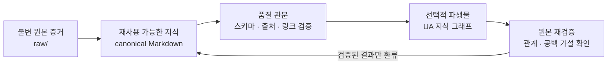
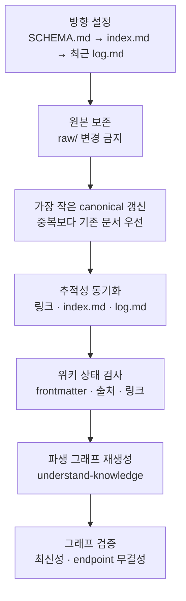

# PKM Study

원본의 근거를 보존하고 검증 가능한 Markdown 지식으로 컴파일해 반복해서 활용하도록 돕는 한국어 중심 PKM 참조 저장소입니다.

> [!IMPORTANT]
> **공개 전 차단:** 라이선스 선택과 재배포 권리, 개인정보, 추적 중인 산출물에 대한 검토가 모두 끝나기 전에는 이 저장소를 공개 배포하지 않습니다.

## 이 저장소는 무엇인가

PKM Study는 한국어로 작성된 Markdown/Obsidian 기반 개인 지식관리(PKM) 참조 볼트입니다. 실행형 애플리케이션이나 특정 제품의 기능 모음이 아니라, 원본 증거와 해석을 분리하고 검토된 지식을 오래 재사용하는 운영 방식을 문서로 보여 줍니다.

핵심 자료는 일반 Markdown으로 남기므로 텍스트 편집기에서 바로 읽을 수 있습니다. Obsidian은 탐색과 편집을 돕는 선택 사항이며, 지식의 의미와 출처는 특정 인터페이스에 종속되지 않습니다.

## 핵심 가치

- **불변의 증거:** `raw/`에 보존한 원본은 수정하지 않고, 교정이나 해석은 별도의 canonical 문서에 반영합니다.
- **추적 가능한 출처:** 문서의 메타데이터와 provenance 표지를 통해 핵심 주장을 기존 원본으로 거슬러 올라갈 수 있게 합니다.
- **재사용 가능한 canonical 지식:** 반복해서 쓸 가치가 있는 내용만 개념, 엔티티, 비교, 질의 문서로 컴파일하고 중복과 모순을 관리합니다.
- **도구 독립적 Markdown:** 공개 형식의 텍스트와 명시적인 관계를 중심에 두어 편집기나 분석 도구를 바꿔도 축적한 지식을 유지합니다.

## 주요 기능

- `entities/`, `concepts/`, `comparisons/`, `queries/`로 나뉜 유형별 canonical 문서가 대상, 개념, 의사결정, 재사용 가능한 합성을 구분합니다.
- `SCHEMA.md`와 YAML frontmatter가 파일명, 필수 메타데이터, 태그, 출처, 신뢰도 규칙을 정의합니다.
- `index.md`는 주제별 탐색 지도를, append-only `log.md`는 변경 이력을 제공해 지식이 언제 어떻게 갱신되었는지 추적하게 합니다.
- frontmatter, 출처 경로, 링크, 중복, 모순, 문서 크기를 점검하는 상태 검사가 canonical 지식 편입의 품질 관문으로 작동합니다.
- 검증된 Markdown에서 선택적으로 UA 지식 그래프를 파생해 군집, 브리지, 고립 문서와 약한 관계의 후보를 탐색할 수 있습니다.

## 아키텍처

핵심 저장소는 원본과 해석을 분리합니다. 파생 그래프에서 발견한 관계와 공백은 사실이 아니라 검토할 가설이며, 원본을 다시 확인해 검증된 결과만 canonical 지식에 환류합니다.



이 구조에서 Markdown 볼트가 지식의 기준이며, 그래프는 기준 문서를 대신하지 않는 탐색용 파생물입니다.

## 지식 수명주기

작업은 기존 규칙과 주제를 먼저 파악한 뒤 원본을 보존하고, 필요한 최소 범위만 canonical 문서에 반영하는 순서로 진행합니다. 링크와 탐색 기록을 동기화하고 상태 검사를 통과한 뒤에만 선택적 그래프를 다시 만들며, 생성물의 최신성과 구조 무결성까지 확인해야 한 주기가 끝납니다.



그래프 분석이 제안한 관계를 반영하려면 다음 주기에서 원본을 대조하고 같은 품질 관문을 다시 통과해야 합니다. 자동 생성된 연결이나 레이블만으로 canonical 문서를 바꾸지 않습니다.

## 저장소 구조

| 경로 | 역할 | 권위 |
| --- | --- | --- |
| [`SCHEMA.md`](SCHEMA.md) | canonical 문서의 frontmatter, 태그, 파일명, 출처 규칙 | 콘텐츠 계약의 기준 |
| [`index.md`](index.md) | 유형별 canonical 문서와 한 줄 요약을 모은 탐색 지도 | 현재 주제의 진입점 |
| [`log.md`](log.md) | 수집, 생성, 갱신, 검사 이력을 시간순으로 보존 | append-only 작업 기록 |
| `raw/` | 수집한 원본 증거와 importer별 메타데이터 | 읽기 전용 증거 계층 |
| `entities/`, `concepts/` | 대상과 재사용 가능한 개념을 정리한 canonical 문서 | 검토된 지식 |
| `comparisons/`, `queries/` | 의사결정 비교와 다시 쓸 수 있는 합성 답변 | 검토된 지식 |
| `.ua/` | canonical Markdown에서 파생한 선택적 그래프와 메타데이터 | 재생성 가능한 산출물 |
| `output/` | 내보낸 전달용 결과물 | canonical 권위가 아님 |
| [`AGENTS.md`](AGENTS.md) | 저장소 작업 경계와 검증 계약 | 에이전트 운영 지침 |
| [`run_ua_dashboard.sh`](run_ua_dashboard.sh) | 기존 UA 그래프를 로컬에서 보는 선택적 실행기 | 보조 도구 |

핵심 자산은 평범한 Markdown과 그 출처 관계입니다. 생성된 그래프나 내보낸 결과가 canonical 문서의 내용을 대신하지 않습니다. 이 계층 구분의 배경은 [AI 개인 지식관리](concepts/ai-personal-knowledge-management.md)와 [LLM Wiki](concepts/llm-wiki.md)에서 더 자세히 설명합니다.

## 빠른 시작

핵심 문서를 읽는 데 빌드나 설치 과정은 없습니다.

1. GitHub 저장소 화면의 **Code** 버튼에서 이 저장소 URL을 복사해 원하는 Git 클라이언트로 clone합니다. README에 고정된 clone URL을 두지 않습니다.
2. clone한 디렉터리에서 `cd pkm-study`로 이동합니다.
3. [`SCHEMA.md`](SCHEMA.md)에서 작성 규칙을 확인하고, [`index.md`](index.md)에서 주제를 찾은 뒤, [`log.md`](log.md)의 최근 기록으로 현재 상태를 파악합니다.
4. Markdown 파일을 텍스트 편집기나 GitHub에서 바로 읽습니다. Obsidian은 링크 탐색과 편집을 위한 선택 사항이며 필수 의존성이 아닙니다.

처음에는 [AI 지식 워크플로](concepts/ai-knowledge-workflow.md)에서 전체 흐름을 보고, 저장소 작업이 필요할 때 [`AGENTS.md`](AGENTS.md)의 경계를 함께 확인하는 것을 권장합니다.

## 사용 방법

일상적인 위키 작업은 다음 순서를 지킵니다.

1. **방향 설정:** [`SCHEMA.md`](SCHEMA.md) → [`index.md`](index.md) → 최근 [`log.md`](log.md) 순으로 규칙, 기존 주제, 직전 작업을 읽습니다.
2. **원본 보존:** 새 증거는 `raw/`에 원형과 메타데이터를 보존하고 이후에는 수정하지 않습니다. 교정과 해석은 canonical 문서에서 수행합니다.
3. **가장 작은 canonical 갱신:** 출처의 중심 주제나 여러 출처에서 반복되는 개념만 편입합니다. 동의어 페이지를 새로 만들기보다 기존 문서를 갱신하고, 필요한 문서 집합만 건드립니다.
4. **추적성 동기화:** 출처 경로와 provenance를 정확히 남기고, 관련 문서 링크를 연결하며, 새 문서는 `index.md`에 등록하고 작업은 `log.md` 끝에 추가합니다.
5. **상태 검사:** leading frontmatter, 필수 필드, 날짜와 유형, 등록된 태그, 출처 경로, 링크, 고아·중복 문서, 모순, 문서 크기, 기록된 원본 해시를 점검합니다. 이 저장소에는 이를 대신하는 단일 빌드나 설치 명령이 없습니다.
6. **선택적 파생:** canonical 위키가 바뀌었을 때만 `understand-knowledge`로 그래프를 다시 만들고, 모든 분석 배치 완료와 산출물 무결성을 확인합니다.

검사를 통과하지 못한 탐색 결과나 출처가 확인되지 않은 AI 답변은 canonical 지식으로 승격하지 않습니다.

## Canonical 문서 작성 규칙

세부 계약은 항상 [`SCHEMA.md`](SCHEMA.md)를 기준으로 하며, README의 요약과 충돌하면 스키마가 우선합니다.

- 파일명은 소문자 ASCII 문자, 숫자, 하이픈을 사용하고 폴더와 단수 `type`을 일치시킵니다.
- 문서는 leading YAML frontmatter로 시작하며 `title`, `created`, `updated`, `type`, `tags`, `sources`를 포함합니다.
- 태그는 스키마의 taxonomy에 먼저 등록하고, 빠르게 변하거나 단일 출처인 주장은 기본적으로 `confidence: medium`을 사용합니다.
- `sources`에는 실제로 존재하는 `raw/...` 경로를 공백과 Unicode까지 정확히 기록합니다. 원본 파일 자체는 고치지 않습니다.
- 세 개 이상의 원본을 종합한 문단에는 가능한 경우 `^[raw/.../source.md]` 형태의 provenance 표지를 붙입니다.
- 각 canonical 문서에는 실제 문서로 해석되는 basename 방식 wikilink를 두 개 이상 연결합니다.
- 내용이 바뀌면 `updated`를 올리고, 새 문서는 `index.md`의 해당 유형에 추가하며, 모든 작업은 `log.md`에 append합니다.
- 충돌이 해결되지 않으면 `contested: true`와 `contradictions`로 양쪽 주장을 보존합니다. 200줄을 넘는 문서는 하나의 책임을 갖는 하위 주제로 나눕니다.

## 지식 그래프 사용

UA 지식 그래프는 Markdown을 읽기 위한 필수 요소가 아니라, 검토할 관계·군집·공백 후보를 찾는 선택적 파생 계층입니다. 위키 분석의 진입점은 일반 코드 분석용 `understand`가 아니라 `understand-knowledge`입니다. 자세한 순서는 [UA 위키 지식그래프 워크플로](queries/ua-knowledge-graph-workflow.md)를 참고합니다.

> **에이전트 스킬 호출(agent-skill invocation, 셸 명령 아님):** `$understand-anything:understand-knowledge <vault-root>`

위키를 바꾼 뒤 이 스킬을 실행했다면 예상한 모든 분석 배치가 끝났는지 확인하고, 그래프의 `kind`, 비어 있지 않은 노드, edge endpoint, 고유 ID, layer와 tour 배열을 검사합니다. 메타데이터와 그래프가 이번 실행보다 새로워야 하며 dangling edge가 없어야 합니다. 이 검사는 해결되지 않은 위키 링크가 없다는 뜻이 아닙니다. 그래프가 추론한 관계는 원본으로 재검증하기 전까지 가설로 취급합니다.

로컬 대시보드는 이미 생성된 그래프를 탐색할 때만 선택적으로 사용합니다. 실행 전 다음 조건이 필요합니다.

- Bash
- Node.js와 npm/npx
- 네트워크 접근
- 현재 볼트에 이미 생성되어 있는 UA 지식 그래프

```bash
./run_ua_dashboard.sh
```

이 실행기는 고정되지 않은 `latest` 뷰어 패키지를 네트워크에서 내려받아 실행하므로 재현성과 공급망 위험을 검토해야 합니다. 터미널에 토큰이 포함된 로컬 URL이 출력될 수 있으므로 그 주소를 공유하거나 기록하지 마십시오. 일반적인 문서 읽기나 상태 검사에서는 대시보드를 실행할 필요가 없습니다.

## 선택적 도구와 자동화

저장소가 직접 보존하는 핵심 형식과 외부 도구의 역할을 구분합니다.

| 구분 | 기술·도구 | 역할 | 제공 상태 |
| --- | --- | --- | --- |
| Core | Markdown | 사람이 읽고 도구가 처리하는 canonical 지식 | 저장소 형식 |
| Core | YAML frontmatter | 유형, 날짜, 태그, 출처, 품질 신호 | 저장소 규칙 |
| Core | GitHub/Obsidian-style links | 문서 관계와 상대 경로 탐색 | 저장소 규칙 |
| Core | JSON artifacts | 선택적 그래프와 메타데이터의 교환 형식 | 파생 형식 |
| Core | Bash launcher | 기존 그래프의 선택적 로컬 뷰어 진입점 | 스크립트만 포함 |
| Optional | Obsidian | 로컬 Markdown 편집과 링크 탐색 | 외부 도구, 번들되지 않음 |
| Optional | Zotero / Zotero MCP | 원본과 서지정보 보존, 에이전트 연결 | 외부 도구, 번들되지 않음 |
| Optional | NotebookLM / notebooklm-py | 선택한 소스 묶음의 질의와 합성 | 외부 도구, 번들되지 않음 |
| Optional | Understand Anything | 위키 그래프 생성, 검증, 시각 탐색 | 외부 도구, 번들되지 않음 |
| Optional | Hermes | 저장소 밖의 gate, cron, gateway 자동화 | 외부 도구, 번들되지 않음 |
| Optional | Graphify | 이질적인 자료에서 관계 경로 탐색 | 외부 도구, 번들되지 않음 |
| Optional | CodeGraph | 코드 심볼, 호출, 변경 영향의 로컬 색인 | 외부 도구, 번들되지 않음 |
| Optional | Orca | 격리된 작업공간에서 에이전트 실행 조정 | 외부 도구, 번들되지 않음 |
| Optional | slides-grab | 검토된 지식을 발표 산출물로 변환 | 외부 도구, 번들되지 않음 |

이 도구들은 핵심 Markdown을 대체하지 않고 역할별로 보완합니다. 저장소 문서는 Hermes 배포나 활성 scheduler의 존재를 증명하지 않습니다. 도입 전에는 각 도구의 최신 문서, 데이터 처리 방식, 보안 경계를 별도로 확인하십시오. 역할 비교는 [AI 지식관리 도구 역할](comparisons/knowledge-tool-roles.md)에서 확인할 수 있습니다.

## 공개 전 필수 점검

## 기여와 지원

## 라이선스
